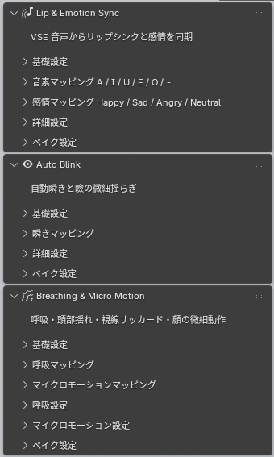
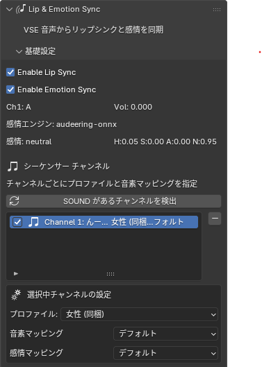
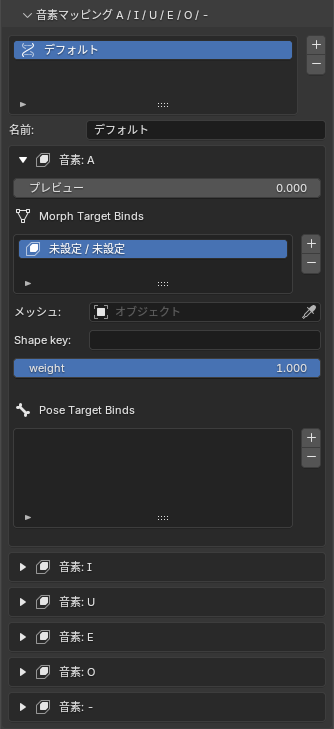
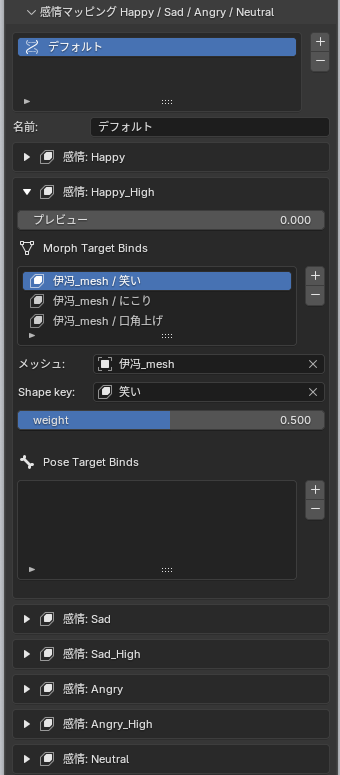
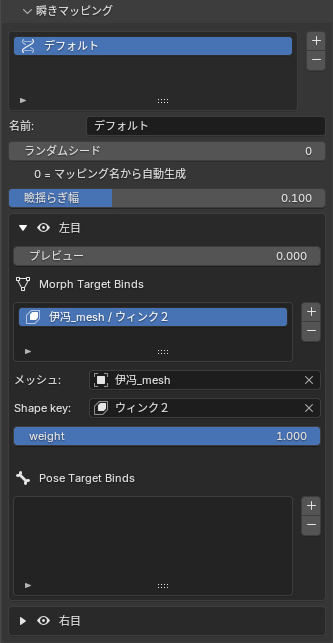
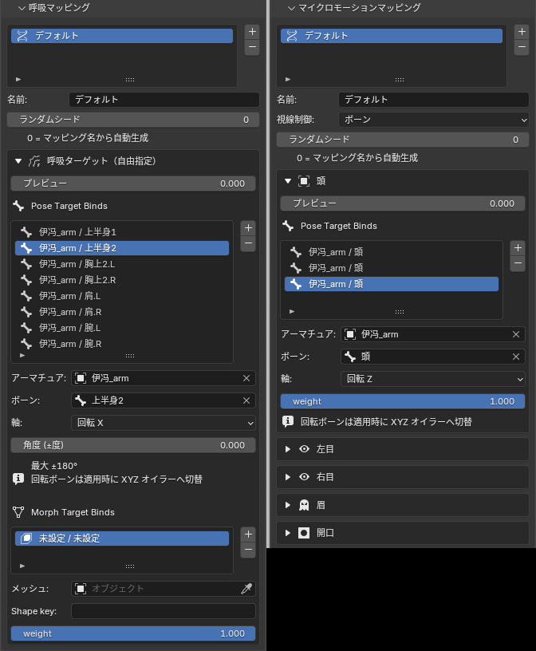
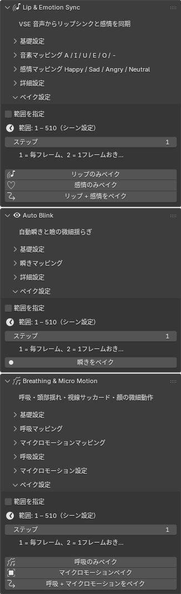

# bAnima

**Breathe life into your Blender characters.**

Blenderで3Dキャラクターを作ることはできます。しかし、そのキャラクターを「生きている」ように見せることは、まったく別の話です。

近年、AivisSpeechやIrodori-TTSをはじめとする高精度なTTSモデルが次々と公開され、キャラクターに喋らせるための音声を用意することは、以前と比べてずっと手軽になりました。しかしBlenderの側では、その音声を活かしてキャラクターをアニメーションさせる手段がほとんど整っていません。リップシンク、瞬き、呼吸、表情の揺らぎ、これらはすべて手付けで対応するしかなく、丁寧にやり切ったとしてもどこか人形のような硬直感が残ります。

**bAnima**は、その問題に向き合うために作られたBlenderアドオンです。

きっかけはリップシンクでした。Unityには[uLipSync](https://github.com/hecomi/uLipSync)をはじめ、音声からリップシンクを自動生成するツールが存在します。しかしBlenderには同等の機能を持つアドオンがほとんどありません。ならば作ろう、そこから始まりました。

実装を進める中で気づいたのは、口の動きだけを自動化しても、キャラクターはまだ「生きて」いないということです。目は瞬きをしない。胸は動かない。表情は張り付いたまま変わらない。

そこでbAnimaは、4つの機能軸を持つアドオンへと発展しました。

- **Lip Sync** — 音声ファイルからリップシンクを自動生成
- **Emotion Sync** — 音声から感情を推定し、表情シェイプキーをリアルタイムに制御
- **Auto Blink** — 生体リズムに基づいた自然な瞬きの自動化
- **Breathing & Micro Motion** — 呼吸・微細な揺らぎによる「生きている感」の付与

bAnimaであなたの3Dキャラクターに、息吹を与えましょう。

---

## サンプル動画

[](https://youtube.com/shorts/rcPDCUSbDMY?feature=share)

---

## 主な機能

| 機能 | 概要 |
|------|------|
| **Lip Sync** | ビデオシーケンサー（VSE）の音声を解析し、A / I / U / E / O / -（無音）の口形をリアルタイム適用。キーフレームへのベイクにも対応 |
| **Emotion Sync** | 音声から Valence / Arousal / Dominance を推定し、Happy / Sad / Angry / Neutral（各 High バリアント含む 7 スロット）の表情をブレンド |
| **Auto Blink** | ガウス分布に基づく瞬き間隔、閉じ・開く速度、瞼の微細揺らぎを自動生成 |
| **Breathing** | 呼吸数（BPM）と吸気:呼気比に基づく周期的な胸・肩などの動き |
| **Micro Motion** | 頭部の微揺れ、視線サッカード、眉・開口の微細ノイズ |
| **マルチチャンネル** | VSE の複数 SOUND ストリップをチャンネル単位で個別設定（プロファイル・マッピングの切り替え） |
| **Morph + Pose** | シェイプキーとアーマチュアポーズの両方に対応。1 音素・1 感情あたり複数ターゲットを重ね合わせ可能 |
| **ベイク** | リップ・感情・瞬き・呼吸・マイクロモーションをそれぞれ独立してキーフレーム化 |



---

## インストール

**要件:** Blender 3.6 以降

1. [Releases](https://github.com/TK-design336/bAnima/releases) から最新の `banima-x.y.z.zip` をダウンロード  
   （リポジトリからビルドする場合: `.\build_package.ps1 -Target banima`）
2. Blender → **Edit → Preferences → Add-ons**
3. 右上 **▼** → **Install from Disk...**
4. ZIP を選択してインストール
5. 検索欄に「bAnima」と入力し、チェックを入れて有効化

### 感情認識（Emotion Sync）の依存関係

Emotion Sync を使う場合、初回有効化時に **onnxruntime** が自動インストールされます（パネル内の「今すぐインストール」ボタンからも実行可能）。

オフライン環境や配布用に依存関係を同梱する場合:

```powershell
.\build_package.ps1 -Target banima -BundleDeps
```

感情モデルは [audeering Zenodo ONNX](https://zenodo.org/record/6221127)（**CC BY-NC-SA 4.0** — 非商用）を使用します。商用利用には audEERING のライセンスが必要です。

---

## クイックスタート

1. VSE に **SOUND** ストリップを配置したシーンを開く
2. サイドバー（**N**）→ **bAnima** タブ（3D ビューまたはビデオシーケンサー）
3. **Lip & Emotion Sync → 基礎設定**
   - `Enable Lip Sync` / `Enable Emotion Sync` をオン
   - **SOUND があるチャンネルを検出** でチャンネル一覧を更新
4. **音素マッピング** で A / I / U / E / O / - それぞれにシェイプキー（またはポーズボーン）を割り当て
5. **感情マッピング** で Happy / Sad / Angry / Neutral 等の表情を割り当て
6. タイムラインを**再生** — リップシンクと感情が自動適用される（Start Live 等の操作は不要）
7. 必要に応じて **Auto Blink** / **Breathing & Micro Motion** を有効化
8. キーフレーム化したい場合は各パネルの **ベイク** を実行



---

## パラメータ詳細

UI は **3D ビュー** と **ビデオシーケンサー** の両方で同じ構成です。以下、パネル順に解説します。

### Lip & Emotion Sync

#### 基礎設定

| パラメータ | 説明 |
|-----------|------|
| **Enable Lip Sync** | リップシンクのリアルタイム適用をオン/オフ |
| **Enable Emotion Sync** | 感情推定と表情適用をオン/オフ |
| **検出 / Vol** | 現在フレームの音素と音量（log10 RMS）。チャンネル選択時は `Ch{n}: {音素}` 形式 |
| **感情エンジン** | 使用中の感情推定バックエンド（例: `audeering-onnx`） |
| **感情 (H/S/A/N)** | 推定された主感情名と Happy / Sad / Angry / Neutral 各スコア |
| **SOUND があるチャンネルを検出** | VSE 上の SOUND ストリップからチャンネル一覧を再構築 |
| **シーケンサー チャンネル** | チャンネルごとに個別設定。一覧から対象チャンネルを選択 |
| **プロファイル** | 選択中チャンネルの MFCC プロファイル。同梱の男性/女性、または Unity uLipSync からエクスポートした JSON |
| **音素マッピング** | 選択中チャンネルに割り当てる音素マッピングプリセット |
| **感情マッピング** | 選択中チャンネルに割り当てる感情マッピングプリセット |

#### 音素マッピング（A / I / U / E / O / -）

各音素スロットに **Morph Target Binds**（メッシュ + シェイプキー + weight）と **Pose Target Binds**（アーマチュア + ボーン + 軸 + weight）を登録します。

| 項目 | 説明 |
|------|------|
| **weight** | その音素が最大（100%）のときのシェイプキー値またはポーズ変形量（0〜1） |
| **プレビュー** | 編集時にその音素だけを一時適用（再生中は無視）。口形の確認に便利 |

複数の Morph / Pose バインドを同一音素に登録すると、重み付きで同時にブレンドされます。



#### 感情マッピング（Happy / Sad / Angry / Neutral）

7 スロット: `Happy`, `Happy_High`, `Sad`, `Sad_High`, `Angry`, `Angry_High`, `Neutral`

音声から推定した感情スコアに応じて、登録したシェイプキー / ポーズをブレンドします。`_High` スロットは感情強度が閾値を超えたときに追加で乗るバリアントです。各スロットの **プレビュー** スライダーで表情を一時確認できます。



#### ベイク設定

| パラメータ | 説明 |
|-----------|------|
| **範囲を指定** | オフ: シーンの `frame_start`〜`frame_end`（パネルに `範囲: 1 – 510（シーン設定）` と表示）。オン: 下の開始/終了フレームを使用 |
| **ステップ** | 何フレームおきにサンプルしてキーフレームを打つか（1 = 毎フレーム、2 = 1 フレームおき…） |
| **リップのみベイク** | 口形キーフレームのみ生成 |
| **感情のみベイク** | 表情キーフレームのみ生成 |
| **リップ + 感情をベイク** | 両方を同時にベイク |

#### 詳細設定 — リップシンク

| パラメータ | 説明 |
|-----------|------|
| **Phoneme Blend** | オン: 複数音素の比率を同時ブレンド。オフ: 最もスコアの高い 1 音素のみ |
| **Smoothness** | 口形変化のスムージング時間定数（小さいほど素早く追従、大きいほど滑らか） |
| **Min Volume (log10)** | この音量未満は無音（`-`）として扱う |
| **Max Volume (log10)** | この音量以上で口の開きが最大になる |
| **Max Blend Value** | 口形ブレンドの上限スケール |

#### 詳細設定 — 感情同期

| パラメータ | 説明 |
|-----------|------|
| **Happy / Sad / Angry 通常/High 境目** | 各感情の通常スロットから `_High` スロットへ移行する強度の閾値（0〜1） |
| **Emotion Smoothness** | 感情変化のローパス（大きいほど緩やかに変化） |
| **Emotion Threshold** | この値未満の感情変化は無視するデッドゾーン |
| **Valence 偏り** | モデル出力の Valence を再マッピングする基準点。0.5 = 無変換。下げると Sad/Angry が出にくく、上げると出やすくなる |
| **Arousal 偏り** | 同上（Arousal 軸）。下げると高テンション（Happy 強・Angry）が出やすく、上げると低テンション（Sad・穏やか Neutral）が出やすい |

---

### Auto Blink

#### 基礎設定

| パラメータ | 説明 |
|-----------|------|
| **Enable Auto Blink** | 自動瞬きと瞼揺らぎの適用をオン/オフ |

#### 瞬きマッピング

| 項目 | 説明 |
|------|------|
| **左目 / 右目** | 各目に Morph Target Binds / Pose Target Binds を設定 |
| **ランダムシード** | 瞬き間隔・揺らぎの再現性用。0 = マッピング名から自動生成 |
| **瞼揺らぎ幅** | 瞬きとは別の微弱な瞼揺らぎの最大ブレンド量（0〜1） |
| **プレビュー** | 編集時に瞬き量を一時適用 |



#### 詳細設定

| パラメータ | 説明 |
|-----------|------|
| **平均瞬き間隔 (秒)** | 瞬き間隔の平均 μ（ガウス分布）。人間はおおよそ 3〜6 秒、デフォルト 4.5 秒 |
| **ゆらぎ幅** | 間隔のランダム性 σ の強さ（大きいほどばらつきが増える） |
| **閉じる時間 (秒)** | 瞼が閉じ切るまでの時間 |
| **開く時間 (秒)** | 瞼が開き切るまでの時間 |
| **瞼揺らぎ速度** | 微細な瞼揺らぎの変化速度（大きいほど速く揺れる） |

#### ベイク設定

瞬きスケジュールを事前計算し、指定フレーム範囲にキーフレームを打ちます。**瞬きをベイク** でキーフレーム化します。

---

### Breathing & Micro Motion

#### 基礎設定

| パラメータ | 説明 |
|-----------|------|
| **Enable Breathing** | 呼吸アニメーションの適用 |
| **Enable Micro Motion** | 頭部揺れ・視線サッカード・顔の微細動作の適用 |

#### 呼吸マッピング

胸・肩・肋骨など、呼吸に連動させたい部位を **呼吸ターゲット（自由指定）** に Morph / Pose で登録します。Pose バインドでは **motion_amount**（回転 ±度 / 移動 ±m / スケール倍率）で変形量を指定します。

#### 呼吸設定

| パラメータ | 説明 |
|-----------|------|
| **呼吸数 (BPM)** | 1 分あたりの呼吸回数。安静時 12〜18 回/分が目安（デフォルト 15） |
| **吸気:呼気 比率 (1:N)** | 呼気側の長さ倍率。生体的には 1.5〜2 程度が自然（デフォルト 1.75） |

呼吸位相はコサイン補間で滑らかに 0（呼気終端）↔ 1（吸気ピーク）を往復します。

#### マイクロモーションマッピング

| スロット | 説明 |
|---------|------|
| **頭** | 頭部ボーンの微揺れ（Pose のみ） |
| **左目 / 右目** | 視線サッカード（ボーン制御時） |
| **lookUp / lookDown / lookLeft / lookRight** | 視線サッカード（シェイプキー制御時） |
| **眉 / 開口** | Perlin 風ノイズによる微細変動 |

| 項目 | 説明 |
|------|------|
| **視線制御** | `ボーン`: 左右目ボーンで視線を制御 / `シェイプキー`: look 方向シェイプキーで制御 |
| **ランダムシード** | 揺れ・サッカードの再現性用。0 = マッピング名から自動生成 |



#### マイクロモーション設定

**頭部揺れ**

| パラメータ | 説明 |
|-----------|------|
| **頭部揺れ 強度 (±度)** | 各ポーズバインドの移動量上限。バインドの weight でさらにスケール |
| **揺れ間隔 最小/最大 (秒)** | 次の揺れまでの待機時間の範囲 |
| **行き・戻り時間 最小/最大 (秒)** | 中立位置 → ランダム目標 → 中立位置 それぞれの移動時間 |

**視線サッカード**

| パラメータ | 説明 |
|-----------|------|
| **視線サッカード** | オン/オフ |
| **サッカード間隔 最小/最大 (秒)** | 次の視線移動までの間隔 |
| **行き時間 / 戻り時間 (秒)** | 新しい視線位置へ移動する時間 / 中立位置へ戻す時間 |
| **サッカード強度 (±度)** | ボーン制御時の視線移動量 |
| **サッカード強度（シェイプキー）** | シェイプキー制御時の look 方向ブレンド量 |

**眉・開口マイクロ変動**

| パラメータ | 説明 |
|-----------|------|
| **眉・開口 ノイズ強度** | 眉・開口シェイプキーへの微細ノイズ振幅 |

#### ベイク設定

呼吸とマイクロモーションはそれぞれ独立してベイクできます。**呼吸のみベイク** / **マイクロモーションベイク** / **呼吸 + マイクロモーションをベイク** から選択します。

---

### ベイク設定（全モジュール共通）

3 つの機能パネルそれぞれに **ベイク設定** サブパネルがあります。`範囲を指定` がオフのときはシーンのフレーム範囲（例: `1 – 510（シーン設定）`）が使われます。



| モジュール | ベイクボタン |
|-----------|-------------|
| **Lip & Emotion Sync** | リップのみベイク / 感情のみベイク / リップ + 感情をベイク |
| **Auto Blink** | 瞬きをベイク |
| **Breathing & Micro Motion** | 呼吸のみベイク / マイクロモーションベイク / 呼吸 + マイクロモーションをベイク |

---

## 技術的説明

### アーキテクチャ概要

```
VSE (SOUND ストリップ)
        │
        ▼
   audio.py ── フレーム位置の音声サンプリング
        │
        ├─► LipSyncEngine (engine.py + algorithm.py)
        │       MFCC 解析 → 音素スコア → スムージング
        │       └── applicator.py → シェイプキー / ポーズ
        │
        ├─► EmotionEngine (emotion_engine.py + emotion_onnx.py)
        │       wav2vec2 ONNX → VAD → 4 感情スコア → スムージング
        │       └── emotion_applicator.py → 表情シェイプキー / ポーズ
        │
        ├─► BlinkEngine (blink_engine.py)
        │       ガウス間隔スケジュール + 瞼微細揺らぎ
        │       └── blink_applicator.py
        │
        └─► BreathingEngine / MicroMotionEngine
                呼吸位相 / 頭部スケジュール / サッカード / ノイズ
                └── motion_applicator.py
                        │
                        ▼
              layer_applicator.py（レイヤー合成）
              キーフレーム評価 + 手続きデルタの非破壊的加算
```

bAnima の UI 層（`banima/`）は、実装コア（`blipsync/`）のパネル描画関数を再利用するスタック構成です。旧 BlipSync 単体タブは自動的に非表示になります。

### リップシンク（MFCC）

[uLipSync](https://github.com/hecomi/uLipSync) の MFCC アルゴリズムを Python / NumPy で移植しています。

1. VSE から現在フレーム付近の音声をリングバッファとして取得
2. ローパス → ダウンサンプリング（16 kHz）→ MFCC 特徴量抽出
3. プロファイル内の各音素ベクトルとの類似度（コサイン類似度等）を計算
4. 音量正規化後、最もスコアの高い音素（または Phoneme Blend 時は比率ブレンド）を決定
5. `smooth_damp` による指数スムージングで口形を滑らかに遷移

プロファイルは uLipSync の JSON 形式と互換です。キャラクターごとに Unity uLipSync でキャリブレーションしたプロファイルを使うと精度が向上します。

### 感情推定（VAD → 表情）

[audeering wav2vec2-L-robust](https://zenodo.org/record/6221127) の ONNX エクスポートを **onnxruntime** で推論します（PyTorch / SpeechBrain 不要）。

1. 約 1 秒（16 kHz × 16,000 サンプル）の音声ウィンドウを入力
2. モデル出力から Valence / Arousal / Dominance（VAD）を取得
3. VAD を Happy / Sad / Angry / Neutral の 4 スコアに変換
4. Valence / Arousal 偏りパラメータで再マッピング（キャラクター・言語に合わせた調整）
5. 各感情スロットへ `smooth_damp` でスムージング適用
6. 強度が閾値を超えると `_High` バリアントを追加ブレンド

### 自動瞬き

瞬き間隔は **ガウス分布**（μ = 平均瞬き間隔、σ = ゆらぎ幅 × μ/3）でサンプリングし、人間の不規則な瞬きリズムを再現します。

各瞬きは **閉じる時間 → 開く時間** の 2 フェーズ線形補間で瞼の開閉量（0〜1）を計算します。瞬きとは独立に、複数周波数の正弦波を重ねた **瞼微細揺らぎ** を左右目に位相差付きで加算します。

### 呼吸

呼吸位相は BPM と吸気:呼気比から 1 サイクルの長さを決定し、吸気区間は `0.5 × (1 - cos(πt))`、呼気区間は `0.5 × (1 + cos(πt))` で滑らかに 0↔1 を往復します。マッピングに登録された Morph / Pose ターゲットへこの位相値を weight として適用します。

### マイクロモーション

- **頭部揺れ:** ランダム間隔で待機 → ランダム目標角度へ smoothstep 移動 → 中立へ復帰、を Deterministic RNG で繰り返し
- **視線サッカード:** 同様のスケジュールで左右目（または look シェイプキー）を短時間ジャンプさせ、ゆっくり中立へ戻す
- **眉・開口:** 瞬きエンジンと同系統の多周波正弦ノイズ

### レイヤー合成とベイク

リアルタイム適用時、手続き的アニメーション（瞬き・呼吸・マイクロモーション）は **既存キーフレームを上書きせず**、評価値にデルタを加算するレイヤー方式（`layer_applicator.py`）を採用しています。これにより、手付けのアニメーションと自動生成モーションを共存させられます。

ベイク時は指定フレーム範囲をサンプリングし、各ターゲットにキーフレームを直接挿入します。ベイク後は手続き適用をオフにしても同じ見た目を維持できます。

### リアルタイム更新

`handlers.py` が Blender のフレーム変更・再生イベントをフックし、以下のタイミングで更新します。

- タイムライン**再生中**
- **レンダー** / プレビューレンダー中
- **スクラブ**（フレーム変更）時 — 一時的に手続きモーションのベースをリセット

---

## 注意事項

- VSE に **SOUND** ストリップが必要です（外部参照 WAV 等）
- シェイプキー適用時は対象メッシュにシェイプキーが設定されていること
- ポーズ適用時、回転ボーンは適用時に XYZ オイラーへ自動切替されます
- リップシンク精度はキャラクター・音声・プロファイルに依存します
- 感情モデル（audeering）は **CC BY-NC-SA 4.0** です。商用プロジェクトではライセンスを確認してください
- uLipSync のアルゴリズム・プロファイルデータの利用については [元プロジェクトのライセンス](https://github.com/hecomi/uLipSync/blob/main/LICENSE.md) に従ってください

---

## ビルド（開発者向け）

```powershell
# bAnima パッケージ（blipsync コア同梱）
.\build_package.ps1 -Target banima

# onnxruntime + 感情モデル同梱版
.\build_package.ps1 -Target banima -BundleDeps
```

出力: `banima-0.2.50.zip`（バージョンは `banima/__init__.py` の `bl_info["version"]` に同期）

---

## ライセンス

- **bAnima / blipsync コア:** （リポジトリの LICENSE を参照）
- **uLipSync MFCC アルゴリズム:** [uLipSync LICENSE](https://github.com/hecomi/uLipSync/blob/main/LICENSE.md)
- **audeering 感情モデル:** [CC BY-NC-SA 4.0](https://creativecommons.org/licenses/by-nc-sa/4.0/)
